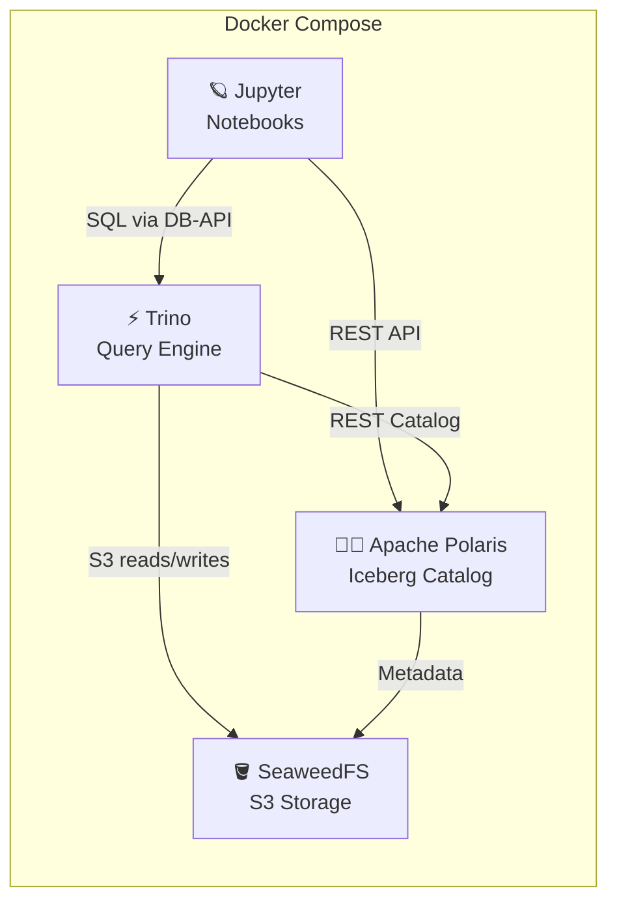

# 🏗️ Lakehouse Playground

A local development environment for an **Open Data Lakehouse** using Docker Compose.

## Architecture



## Components
| Component | Role | Image |
|---|---|---|
| **SeaweedFS** | S3-compatible distributed storage | `chrislusf/seaweedfs:4.17` |
| **Apache Polaris** | Iceberg REST catalog | `apache/polaris:1.3.0-incubating` |
| **Trino** | SQL query engine | `trinodb/trino:479` |
| **Jupyter** | Interactive notebooks (PySpark) | `jupyter/pyspark-notebook:spark-3.5.0` |

**Data Pattern:** Medallion Architecture — `bronze` → `silver` → `gold` S3 buckets.

---

## Quick Start

### 1. Start the stack

```bash
docker compose up -d
docker compose ps   # wait until all services are healthy
```

### 2. Open the setup notebook

Open **[http://localhost:8888](http://localhost:8888)** and use token: **`lakehouse`**

Navigate to `work/01_setup.ipynb` and run all cells. The notebook will:
- ✅ Create `bronze`, `silver`, `gold` S3 buckets
- ✅ Obtain a Polaris API token & register the catalog
- ✅ Create Medallion namespaces
- ✅ Connect to Trino and run your first Iceberg queries

### 3. Explore advanced patterns

| # | Notebook | Pattern |
|---|---|---|
| 1 | `01_setup.ipynb` | Lakehouse setup & Medallion ETL (Bronze → Silver → Gold) |
| 2 | `02_cdc_snapshotting.ipynb` | CDC Log Compaction — MERGE INTO with dedup |
| 3 | `03_evolution.ipynb` | Schema, Partition & Sort Order Evolution |
| 4 | `04_maintenance.ipynb` | Iceberg Table Maintenance — Expire Snapshots, Orphan Files, Compaction, Manifests |
| 5 | `05_write_audit_publish.ipynb` | Write-Audit-Publish — safe ingestion with Iceberg branches (PySpark) |
| 6 | `06_advanced_views_and_streaming.ipynb` | Incremental Aggregations & CDC via `table_changes` |
| 7 | `07_advanced_trino_iceberg_features.ipynb` | Object Store Layout, ANALYZE, `add_files` |

---

## Service URLs

| Service | URL | Credentials |
|---|---|---|
| **Jupyter Lab** | [http://localhost:8888](http://localhost:8888) | Token: `lakehouse` |
| **Trino Web UI** | [http://localhost:8443](http://localhost:8443) | No auth |
| **Polaris REST API** | [http://localhost:8181](http://localhost:8181) | See `.env` |
| **Polaris Management** | [http://localhost:8182](http://localhost:8182) | — |
| **SeaweedFS Master** | [http://localhost:9333](http://localhost:9333) | — |
| **SeaweedFS S3 API** | [http://localhost:8333](http://localhost:8333) | See `.env` |

---

## Project Structure

```
lakehouse-playground/
├── docker-compose.yaml          # All services (4 containers)
├── .env                         # Shared credentials
├── requirements.txt             # Python dependencies
├── README.md
├── notebooks/
│   ├── 01_setup.ipynb                       # Interactive setup & Medallion ETL
│   ├── 02_cdc_snapshotting.ipynb            # CDC log compaction pattern
│   ├── 03_evolution.ipynb                   # Schema, Partition & Sort Order Evolution
│   ├── 04_maintenance.ipynb                 # Iceberg table maintenance operations
│   ├── 05_write_audit_publish.ipynb         # WAP with Iceberg branches (PySpark)
│   ├── 06_advanced_views_and_streaming.ipynb # Incremental aggregations & table_changes
│   └── 07_advanced_trino_iceberg_features.ipynb # Object Store Layout, ANALYZE, add_files
├── seaweedfs/
│   └── s3.json                  # S3 identity config
└── trino/
    └── etc/
        ├── config.properties
        ├── jvm.config
        ├── node.properties
        ├── log.properties
        └── catalog/
            └── iceberg.properties
```

---

## Useful Commands

```bash
# Stop everything
docker compose down

# Stop and remove volumes (clean slate)
docker compose down -v

# View logs for a specific service
docker compose logs -f polaris

# Restart a single service
docker compose restart trino

# Trino CLI
docker exec -it trino trino
```

---

## Troubleshooting

| Problem | Solution |
|---------|----------|
| **Out of memory** | Increase Docker Desktop memory to ≥ 6 GB. Trino alone requests 1 GB heap. |
| **Clean restart** | Run `docker compose down -v` to remove all data, then `docker compose up -d`. |

---

## License

This project is provided as a development playground. Use at your own risk.
